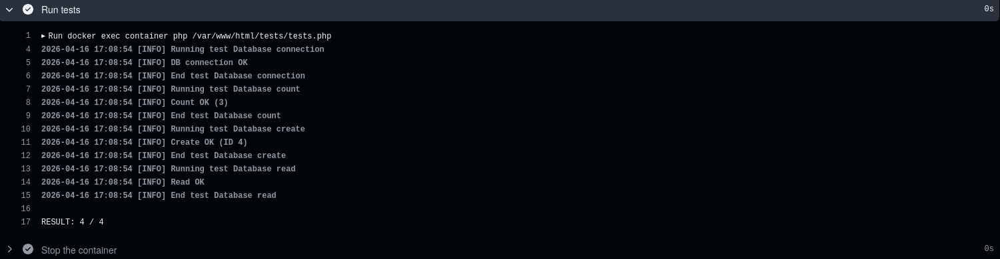

# Лабораторная 8. Непрерывная интеграция с помощью Github Actions

## Выполнил: Виктор Анисимов

## Группа: IA2403

## Дата: 16.04.2026

## Цель

В рамках данной работы студенты научатся настраивать непрерывную интеграцию с помощью Github Actions.

## Задание

Создать Web приложение, написать тесты для него и настроить непрерывную интеграцию с помощью Github Actions на базе контейнеров.

## Подготовка

- [x] install docker

## Выполнение

Создаю структуру файлов:

``` bash
.
├── Dockerfile
├── README.md
├── site
│   ├── config.php
│   ├── index.php
│   ├── modules
│   │   ├── database.php
│   │   └── page.php
│   ├── styles
│   │   └── style.css
│   └── templates
│       └── index.tpl
├── sql
│   └── schema.sql
└── tests
    ├── testframework.php
    └── tests.php
```

Использую класс `Database` для взаимодействия php с SQLite:

``` php
<?php

class Database
{
    private PDO $pdo;

    public function __construct($path)
    {
        // Подключаемся к SQLite-файлу и включаем исключения при ошибках SQL.
        $this->pdo = new PDO("sqlite:" . $path);
        $this->pdo->setAttribute(PDO::ATTR_ERRMODE, PDO::ERRMODE_EXCEPTION);
    }

    public function Execute($sql)
    {
        return $this->pdo->exec($sql);
    }

    public function Fetch($sql)
    {
        $stmt = $this->pdo->query($sql);
        return $stmt->fetchAll(PDO::FETCH_ASSOC);
    }

    public function Create($table, $data)
    {
        // Формируем INSERT динамически на основе переданных полей.
        $columns = implode(", ", array_keys($data));
        $placeholders = ":" . implode(", :", array_keys($data));

        $sql = "INSERT INTO $table ($columns) VALUES ($placeholders)";
        $stmt = $this->pdo->prepare($sql);

        $stmt->execute($data);

        return $this->pdo->lastInsertId();
    }

    public function Read($table, $id)
    {
        $stmt = $this->pdo->prepare("SELECT * FROM $table WHERE id = :id LIMIT 1");
        $stmt->execute(['id' => $id]);
        return $stmt->fetch(PDO::FETCH_ASSOC);
    }

    public function Update($table, $id, $data)
    {
        // Преобразуем массив в "column = :column" для подготовленного UPDATE.
        $set = implode(", ", array_map(fn($k) => "$k = :$k", array_keys($data)));

        $sql = "UPDATE $table SET $set WHERE id = :id";
        $data['id'] = $id;

        $stmt = $this->pdo->prepare($sql);
        return $stmt->execute($data);
    }

    public function Delete($table, $id)
    {
        $stmt = $this->pdo->prepare("DELETE FROM $table WHERE id = :id");
        return $stmt->execute(['id' => $id]);
    }

    public function Count($table)
    {
        // Быстрый подсчет строк таблицы.
        $stmt = $this->pdo->query("SELECT COUNT(*) as cnt FROM $table");
        $row = $stmt->fetch(PDO::FETCH_ASSOC);
        return (int)$row['cnt'];
    }
}
```

Использую класс `Page` для работы с страницами:

``` php
<?php

class Page
{
    private string $template;

    public function __construct($template)
    {
        $this->template = $template;
    }

    public function Render($data)
    {
        // Загружаем HTML-шаблон и подставляем значения вида {{key}}.
        $content = file_get_contents($this->template);

        foreach ($data as $key => $value) {
            $content = str_replace("{{" . $key . "}}", $value, $content);
        }

        return $content;
    }
}
```

Шаблон страницы (файл templates/index.tpl):

``` tpl
<!DOCTYPE html>
<html>
<head>
    <title>{{title}}</title>
    <link rel="stylesheet" href="styles/style.css">
</head>
<body>
    <h1>{{title}}</h1>
    <div>{{content}}</div>
</body>
</html>
```

Главный файл index.php выполняющий:

- подключение к бд,
- установку шаблона,
- проверки, установлено ли значение параметра page в GET запросе.

``` php
<?php

require_once __DIR__ . '/modules/database.php';
require_once __DIR__ . '/modules/page.php';
require_once __DIR__ . '/config.php';

// Инициализация доступа к БД и шаблонизатору страницы.
$db = new Database($config["db"]["path"]);
$page = new Page(__DIR__ . '/templates/index.tpl');

// проверяет установленно ли значение параметра page в url запросе
$pageId = isset($_GET['page']) ? (int)$_GET['page'] : 1;

// Читаем запись по id из таблицы page.
$data = $db->Read("page", $pageId);

if (!$data) {
    // Если записи нет, показываем безопасный fallback-контент.
    $data = [
        "title" => "Not found",
        "content" => "Page does not exist"
    ];
}

echo $page->Render($data);
```

Создаём маленькую табличку с несколькими записями:

``` sql
-- Таблица страниц, которые отображаются в приложении.
CREATE TABLE page (
    id INTEGER PRIMARY KEY AUTOINCREMENT,
    title TEXT,
    content TEXT
);

-- Стартовые данные для проверки чтения и тестов.
INSERT INTO page (title, content) VALUES ('Page 1', 'Content 1');
INSERT INTO page (title, content) VALUES ('Page 2', 'Content 2');
INSERT INTO page (title, content) VALUES ('Page 3', 'Content 3');
```

Использую предоставленный в заданий фраемворк для тестов:

``` php
<?php

function message($type, $message) {
    // Единый формат логов для удобного чтения вывода в CI.
    $time = date('Y-m-d H:i:s');
    echo "{$time} [{$type}] {$message}" . PHP_EOL;
}

function info($message) {
    message('INFO', $message);
}

function error($message) {
    message('ERROR', $message);
}

function assertExpression($expression, $pass = 'Pass', $fail = 'Fail'): bool {
    if ($expression) {
        info($pass);
        return true;
    }
    error($fail);
    return false;
}

class TestFramework {
    private $tests = [];
    private $success = 0;

    public function add($name, $test) {
        $this->tests[$name] = $test;
    }

    public function run() {
        // Последовательно запускаем зарегистрированные тесты.
        foreach ($this->tests as $name => $test) {
            info("Running test {$name}");
            if ($test()) {
                $this->success++;
            }
            info("End test {$name}");
        }
    }

    public function getResult() {
        return "{$this->success} / " . count($this->tests);
    }
}
```

Использую тесты написанные под кастомный враемворк:

``` php
<?php

require_once __DIR__ . '/testframework.php';
require_once __DIR__ . '/../config.php';
require_once __DIR__ . '/../modules/database.php';
require_once __DIR__ . '/../modules/page.php';

// Общий раннер, который собирает и запускает тесты.
$testFramework = new TestFramework();

/**
 * 1. DB connection test
 */
function testDbConnection() {
    global $config;

    try {
        // Проверяем, что объект БД успешно создается с текущим конфигом.
        $db = new Database($config["db"]["path"]);
        return assertExpression($db instanceof Database, "DB connection OK", "DB connection FAIL");
    } catch (Exception $e) {
        error("DB connection exception: " . $e->getMessage());
        return false;
    }
}

/**
 * 2. Count test
 */
function testDbCount() {
    global $config;

    try {
        $db = new Database($config["db"]["path"]);
        // Если таблица доступна, запрос COUNT должен выполниться без ошибки.
        $count = $db->Count("page");

        return assertExpression($count >= 0, "Count OK ($count)", "Count FAIL");
    } catch (Exception $e) {
        error("Count exception: " . $e->getMessage());
        return false;
    }
}

/**
 * 3. Create test
 */
function testDbCreate() {
    global $config;

    try {
        $db = new Database($config["db"]["path"]);

        // Проверяем вставку записи в таблицу page.
        $id = $db->Create("page", [
            "title" => "Test Page",
            "content" => "Hello world"
        ]);

        return assertExpression($id > 0, "Create OK (ID $id)", "Create FAIL");
    } catch (Exception $e) {
        error("Create exception: " . $e->getMessage());
        return false;
    }
}

/**
 * 4. Read test
 */
function testDbRead() {
    global $config;

    try {
        $db = new Database($config["db"]["path"]);

        // Создаем запись и сразу читаем ее обратно по id.
        $id = $db->Create("page", [
            "title" => "Read Test",
            "content" => "Read content"
        ]);

        $row = $db->Read("page", $id);

        // Валидация: запись есть и нужное поле совпадает.
        $ok = $row && isset($row["title"]) && $row["title"] === "Read Test";

        return assertExpression($ok, "Read OK", "Read FAIL");
    } catch (Exception $e) {
        error("Read exception: " . $e->getMessage());
        return false;
    }
}

/**
 * Register tests
 */
$testFramework->add('Database connection', 'testDbConnection');
$testFramework->add('Database count', 'testDbCount');
$testFramework->add('Database create', 'testDbCreate');
$testFramework->add('Database read', 'testDbRead');

/**
 * Run tests
 */
$testFramework->run();

echo PHP_EOL . "RESULT: " . $testFramework->getResult() . PHP_EOL;
```

Создал `Dockerfile` со следующим содержимым:

``` Dockerfile
FROM php:7.4-fpm as base

# Устанавливаем sqlite-клиент и расширение PDO для работы приложения с SQLite.
RUN apt-get update && \
    apt-get install -y sqlite3 libsqlite3-dev && \
    docker-php-ext-install pdo_sqlite

# Отдельный volume для персистентной базы данных.
VOLUME ["/var/www/db"]

COPY sql/schema.sql /var/www/db/schema.sql

# Инициализируем БД из schema.sql на этапе сборки образа.
RUN echo "prepare database" && \
    cat /var/www/db/schema.sql | sqlite3 /var/www/db/db.sqlite && \
    chmod 777 /var/www/db/db.sqlite && \
    rm -rf /var/www/db/schema.sql && \
    echo "database is ready"

COPY site/ /var/www/html
```

Создал `.github/workflows/main.yml` с содержимым:

``` yml
name: CI

on:
  push:
    branches:
      - main

jobs:
  build:
    runs-on: ubuntu-latest
    steps:
      - name: Checkout
                # Забираем исходники репозитория в раннер.
        uses: actions/checkout@v4
      - name: Build the Docker image
                # Собираем образ приложения с подготовленной SQLite-схемой.
        run: docker build -t containers08 .
      - name: Create `container`
                # Подключаем volume с базой по пути /var/www/db.
        run: docker create --name container --volume database:/var/www/db containers08
      - name: Copy tests to the container
        run: docker cp ./tests container:/var/www/html
      - name: Up the container
        run: docker start container
      - name: Run tests
                # Запускаем кастомный php-раннер тестов внутри контейнера.
        run: docker exec container php /var/www/html/tests/tests.php
      - name: Stop the container
        run: docker stop container
      - name: Remove the container
        run: docker rm container
```

Рассмотрим конфигурацию `main.yml`:

- `name` - название конфигурации
- `on` - условие вызова. В данном случае при push в main
- `jobs` - ключ содержащий все задачи
  - `build` - произвольное имя задачи
    - `runs-on` - версия OS для выполнения
    - `steps` - именованые шаги выполнения вида: название, команда
    - `uses` - использование одной из существующих команд
    - `run` - запуск своей

В скрипте происходит:

1. Клонирование репозитория в среду
2. Постройка образа
3. Создание контейнера
4. Копирование тестов в контейнер
5. Запуск контейнера
6. Запуск тестов в контейнере
7. Остановка контейнера
8. Удаление контейнера

### Проверим работоспособность проекта

Нашёл две ошибки:

- случайно прописал не то название таблицы;
- указал не правильный путь в конфиге.

После ещё одной попытки, понял, что __DIR__ в конфиге указывал на папку, в которой лежал (`/var/www/html`). Но не в этой папке лежит бд, а в `/var/www/db/`.

Теперь всё заработало:



## Ответы на вопросы

1. Что такое непрерывная интеграция?

    Непрерывная интеграция, это такой способ разработки проекта, где разработчики часто выполняют слияние с рабочим приложением новый код, а проверка работоспособности приложения после слияния выполняется автоматически.

2. Для чего нужны юнит-тесты? Как часто их нужно запускать?

    Юнит-тесты необходимы для проверки логики приложения, а так же для фиксирования правильного способа работы частей приложения (классы, модули и т.д.). Их можно запускать как локально (обычно юнит тесты не требовательны к ресурсам). Так же они могут запускаться автоматически при правильной настройки CI.

3. Что нужно изменить в файле .github/workflows/main.yml для того, чтобы тесты запускались при каждом создании запроса на слияние (Pull Request)?

    Нужно заменить `pull` на `pull_request`:

    ``` yml
    on:
      pull_request:
        branches:
          - main
    ```

4. Что нужно добавить в файл .github/workflows/main.yml для того, чтобы удалять созданные образы после выполнения тестов?

    В конец нужно добавить:

    ``` yml
    - name: Remove docker image
      run: docker image rm containers08
    ```

## Вывод

Научился базово использовать github Actions для CI.
